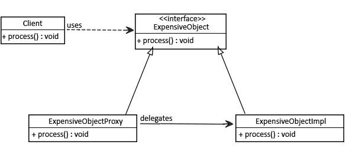

# Structure Designing Pattern - Proxy

By short- Proxy design pattern is used when you want to provide controlled access to a functionality.

You do not want to give a functionality directly to a client, function was provided to client via proxy class



## Implementation with Java

1. create an interface to expose function of target class

```java
public interface ExpensiveObj {
    void process();
}
```

2. target class implement interface

```java
public class ExpensiveObjectImpl implements ExpensiveObj {
    public ExpensiveObjectImpl(){
        heavyInitialConfiguration();
    }
    @Override
    public void process() {
        System.out.println("Processing completed");
    }
    private void heavyInitialConfiguration(){
        // do initial ....
    }
}

```

3. Proxy class initialize target class

```java
public class ExpensiveObjectProxy implements ExpensiveObj {
    private static ExpensiveObj obj;
    @Override
    public void process() {
        if(obj== null){
            obj = new ExpensiveObjectImpl();
        }
        obj.process();
    }
}
```

## Dynamic Proxy

Dynamic proxy allows one single class with one single method to service multiple methods calls to arbitary classes with an abitary number of methods

A Dynamic proxy can be though of as a kind of Facade, it routes all method invocations to a single handler

## Simple proxy

```java
public class DynamicInvocationHandler implements InvocationHandler {
    @Override
    public Object invoke(Object proxy, Method method, Object[] args) throws Throwable {
        System.out.println("Invocation method:"+method.getName());
        return 42;
    }
}
```

## Creating proxy instance

```java
public class DynamicaProxyTest {
    public static void main(String[] args) {
        Map proxyInstance = (Map) Proxy.newProxyInstance(DynamicaProxyTest.class.getClassLoader(),
                new Class[] {Map.class},
                new DynamicInvocationHandler());
        proxyInstance.put("key", "Dynamic Proxy");
        System.out.println(proxyInstance.get("key"));

    }
}

```
output:
Invocation method:put
Invocation method:get
42

Dynamic proxy - all call to target, will be direct to single proxy class invoke method

## Invoke handler via Lambda expression

```java
 Map proxyInstance =  (Map) Proxy.newProxyInstance(DynamicaProxyTest.class.getClassLoader(),
                new Class[] {Map.class},
                ((proxy, method, args1) -> {
                    if(method.getName().equalsIgnoreCase("isEmpty")){
                        return true;
                    }else{
                        return 54;
                    }
                }));
```

## Realy world Scenario

Suppose we want to record how long our functions take to execute, To this extent, we first define a handler capabale of wrapping the "real" object tracking time information and reflective invocation.

```java
public class TimeDynamicInvocationHandler implements InvocationHandler {
    private Object target;
    private final Map<String, Method> methods = new HashMap<>();
    public TimeDynamicInvocationHandler(Object target){
        this.target = target;
        for(Method method: target.getClass().getDeclaredMethods()){
            methods.put(method.getName(), method);
        }
    }
    @Override
    public Object invoke(Object proxy, Method method, Object[] args) throws Throwable {
        long start = System.nanoTime();
        Object result = method.invoke(target, args);
        long end = System.nanoTime();
        return result;
    }
}
```

## cglib Dynamic proxy

classed in java are loaded dynamically at runtime, Cglib is using this feature to make it possible to add new cleases to an already running java program.

Hibernate uses cglib for generate of dynamic proxies, for example, it will not return full object stored in a database but it will return an instrumented version of stored class that lazy loads values from the database on demand.

### Implementing Proxy using cglib

#### dependency

```xml
 <dependency>
            <groupId>cglib</groupId>
            <artifactId>cglib</artifactId>
            <version>3.2.4</version>
        </dependency>
```

#### Implementing Proxy using cglib

```java
public class PersonService {
    public String sayHello(String name){
        return "Hello " + name;
    }
    public Integer lenthOfName(String name){
        return name.length();
    }
}

public class CglibProxyTest {
    public static void main(String[] args) {
        Enhancer enhancer = new Enhancer();
        enhancer.setSuperclass(PersonService.class);
        enhancer.setCallback((FixedValue) ()->
            "Hello Larry"
        );
        PersonService proxy = (PersonService) enhancer.create();
        System.out.println(proxy.sayHello(null));
    }
}
```

Enhancer class allows us to create a proxy by dynamically extending a PersonService class by using setSupperClass()

The FixedValue is a callback interface that simply returns the value from he proxied method. Executeing sayHellow method on a proxy returned a value specified in a proxied method

#### Returning value Depending on a method signature

```java
 Enhancer enhancer = new Enhancer();
        enhancer.setSuperclass(PersonService.class);
        enhancer.setCallback((MethodInterceptor) (obj, method, args2, proxy)->{
            if(method.getDeclaringClass() != Object.class && method.getReturnType() == String.class){
                return "Dynamic Proxy";
            }else {
                return proxy.invokeSuper(obj, args2);
            }
        });
        Object proxy = (Object) enhancer.create();
        System.out.println(proxy.getClass() + "---"+ proxy.equals("true"));
        PersonService proxy2 = (PersonService) enhancer.create();
        System.out.println(proxy2.sayHello(null));
```

We used a MethodInterceptor interface to intercept all calls to the proxy and deside if want to make a specific call or execute a method from a superclass.

## Bean Creattor
Another usaful construct from the cglib is a BeanCreator class, it allow us to dynamically create beans and to add fields together with setter and getter methods

```java
  BeanGenerator beanGenerator = new BeanGenerator();
        beanGenerator.setSuperclass(PersonService.class);
        beanGenerator.addProperty("name", String.class);
        PersonService proxyPersonService = (PersonService) beanGenerator.create();
        Method setter = proxyPersonService.getClass().getMethod("setName", String.class);
        setter.invoke(proxyPersonService, "string value set by cglib");
        System.out.println(proxyPersonService.getClass().getMethod("getName").invoke(proxyPersonService));
        proxyPersonService.sayHello("Larry Song");
```

## Reference
[https://www.javacodegeeks.com/2013/12/cglib-the-missing-manual.html](https://www.javacodegeeks.com/2013/12/cglib-the-missing-manual.html)