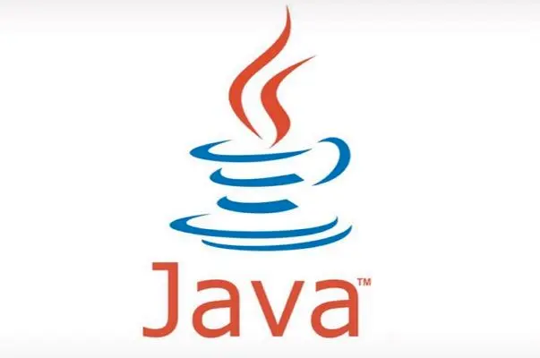
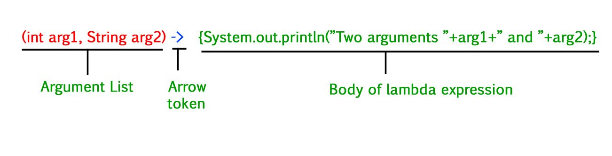

# Lambda Expression


Lambda expressions are added in Java 8 and provide below functionalities.

1. Enable to treat functionality as a method argument, or code as data.
2. A function that can be created without belonging to any class.
3. A lambda expression can be passed around as if it was an object and executed on demand.

## Syntax:



where lambda operator can be:

* Zero parameter:
  `() -> System.out.println("Zero parameter lambda");`
* One parameter:–
` (p) -> System.out.println("One parameter: " + p);`
* Multiple parameters :
`(p1, p2) -> System.out.println("Multiple parameters: " + p1 + ", " + p2);`

``` java
public class LambdaTest {
    public static void main(String[] args) {
        // ArrayList forEach need a Consumer functional interface, so lambda could be as instance of the functional interface
        Arrays.asList(1,2,3,4,5).forEach(e->{
            System.out.println(e);
        });

        List<Double> costBeforeTax = Arrays.asList(100.00, 200.00, 300.01, 400.30);
        // stream filter need precondition
        // map need Function  : Represents a function that accepts one argument and produces a result.
        //reduce()方法传入的对象是BinaryOperator接口，它定义了一个apply()方法，负责把上次累加的结果和本次的元素
        //进行运算，并返回累加的结果：reduce()操作首先初始化结果为指定值(这里是0)，紧接着，reduce()对每个元素依次调用(acc, n) -> acc + n，其中，acc是上次计算的结果：
        double bill = costBeforeTax.stream().filter(cost -> cost > 300).map(cost -> cost + 12* cost).reduce((double) 0, (acc, n) -> acc + n) ;
        System.out.println(bill);
    }
}
```