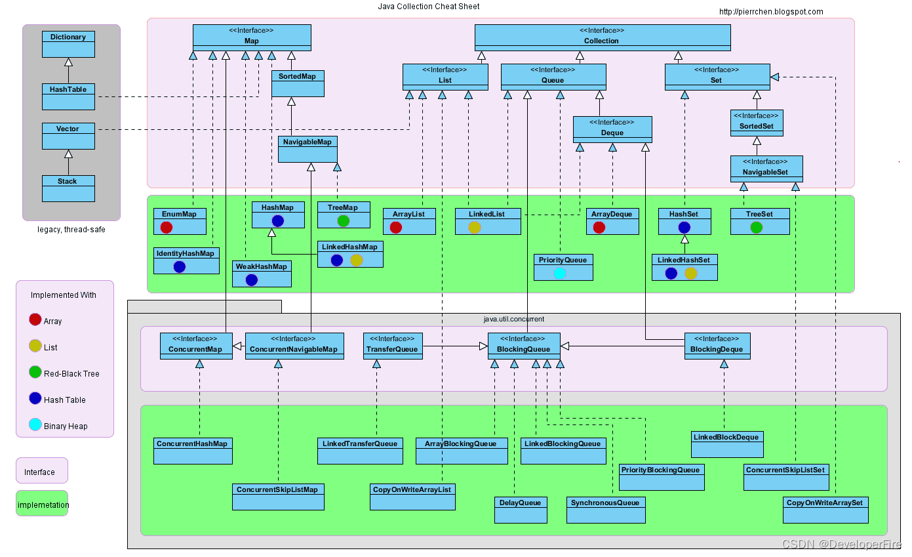

# Java Collections

Java Collections Framework is an importent part of java programming

## Interfaces
java.util.Collection is the root interface of Collections Framework, it contains some importent methods such as size(), iterator(), add(), remove(), clear(), etc.

some other importent interfaces are: 
java.uitl.List 
java.util.Set 
java.util.Queue 
java.util.Map - Map interface does not inherit from The Collection interface, but it is part of Collections Framework

## Map
### HashMap
### ConcurrentHashMap
### BiMap
A bimap i.e, bidirectional map is a map that preserves the uniqueness of its values as well as that of its keys. BiMaps support inverse view, which is another bimap containing the same entries as this bimap but with reversed keys and values.

Below given are some methods provided by Guava BiMap Interface :

| Method | Description | 
| ---- | ---- | 
| put(K key, V value) | Associate a specified value with the specified key in the map | 
| forcePut(K key, V value) | remove existing value before put with new | 
| inverse() | return the inverse view  | 
| putAll(Map<? extend K, ? extend V> map) | copy all the mappings from the specified map to this map | 
| values() | Returns a Collection view of values that contained in the map | 

Return Values & Exceptions :

* put : Throws IllegalArgumentException if the given value is already bound to a different key in this bimap. The bimap will remain unmodified in this event.
* forcePut : Returns the value which was previously associated with the key, which may be null, or null if there was no previous entry.
* putAll : Throws IllegalArgumentException if an attempt to put any entry fails. Note that some map entries may have been added to the bimap before the exception was thrown.
* values : Returns a Set, instead of the Collection specified in the Map interface, as a bimap has unique values.
* inverse : Returns the inverse view of this bimap.

Below given is the implementation for Guava BiMap interface :
