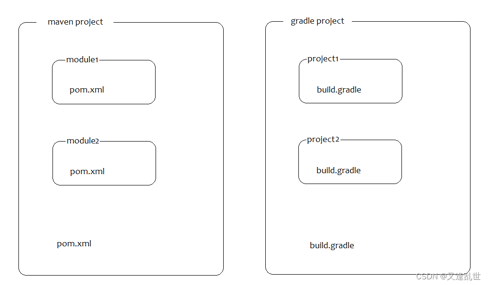

# Gradle Project API

gradle site -> [https://docs.gradle.org](https://docs.gradle.org)

在 maven 项目中，根project下的 子项目，我们一般叫做 module 模块，但是在 gradle 项目中，根project已经明确是一个项目，根项目下的子项目，也叫做project，每个项目的核心标志是项目下都有一个叫做 build.gradle 的文件。

在 gradle 项目中的，根 project 的作用是用来管理 子 project 的，子 project 的作用是具体项目的功能实现。

https://blog.csdn.net/a1053765496/article/details/130190362
