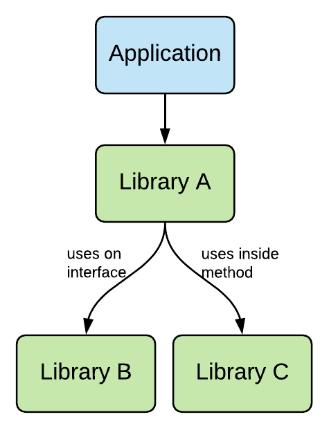

# Gradle Dependency Managemnt

## Gradle dependency configuration basic

let’s imagine a scenario where you have an Application that depends on Library A which has two transitive dependencies, Library B & Library C:
 
 
 
 Some additional information:
 
 * Application uses classes from Library A
 
 * Library A uses classes from Library B and Library C
 
 * Library A exposes Library B on its interface (e.g. one of it’s classes could return a type defined in Library B)
 
 * Library C is only used internally of Library A (e.g. inside methods)
 
 <b>Application binary interface (ABI)</b>
 
 What’s alluded to in points 3 & 4 above is what’s known as the library binary interface or application binary interface (ABI). Some types that fall into the ABI include:
 
 * public method parameters
 
 * return types
 
 * types used in parent classes or interfaces
 
 Types that don’t fall into the ABI include:
 
 * types used in method bodies
 
 * types defined in private method declarations
 
 The important thing to remember about the ABI is that any types used within it need to be declared on the compile classpath. With this information then, we can think about how we’d build up the compile and runtime classpaths for Application:
 
 Compile classpath:
 
 * Library A, as we interact directly with this
 
 * Library B, as Library A exposes this on its interface that we interact with
 
 Runtime classpath
 
 * Library A
 
 * Library B
 
 * Library C, as this is used internally in Library A
 
 If we had the ability to build up these classpaths selectively like this then, we’d benefit from the following:
 
 * cleaner classpaths
 
 * won’t accidentally use a library that we haven’t depended on explicitly e.g. can’t use Library C in Application as it’s not on the compile classpath
 
 * faster compilation due to our cleaner classpath
 
 * less recompilation as when artifacts on the runtime classpath change we don’t need to recompile
 
## The Java Library Gradle plugin makes this possible

The Java Library Gradle plugin makes this fine-grained classpath control possible. It’s up to you as the creator of a library to define which dependencies should be included in the runtime or compile classpaths of whatever application is consuming this library.

We achieve this with the following dependency configurations:

* <b>api </b>- dependencies in the api configuration are part of the ABI of the library we’re writing and therefore should appear on the compile and runtime classpaths

* <b>implementation</b> - dependencies in the implementation configuration aren’t part of the ABI of the library we’re writing. They will appear only on the runtime classpath.

library 是需要给第三方应用程序使用的， 所以 java-library plugin 多出一个api 的使用，api 表示第三方应用程序也需要依赖这个包 而 implementation 表示该包只是在这个项目内部被依赖

Note: java plugin vs java-libray plugin: java-library plugin expands the capability of the java plugin, if your project intended to be consumed by other you should use java-libray plugin

## Deoendency Managment of multi-Module project

### dependencyResolutionManagement

configured in setting.gradle

```groovy
pluginManagement {
    repositories {
        ...
    }
}
dependencyResolutionManagement {

    /**
     * The dependencyResolutionManagement {repositories {...}}
     * block is where you configure the repositories and dependencies used by
     * all modules in your project, such as libraries that you are using to
     * create your application. However, you should configure module-specific
     * dependencies in each module-level build.gradle file. For new projects,
     * Android Studio includes Google's Maven repository and the Maven Central
     * Repository by default, but it does not configure any dependencies
     * (unless you select a template that requires some).
     * 
     * dependencyResolutionManagement {repositories {...}} 區塊
     * 配置專案內所有模組的儲存庫(repositories)及依賴項(dependencies)。
     * 然而，你應該要在每一個模組層級(module-level)的 build.gradle 檔案
     * 配罝專屬該模組的依賴項。
     * 在 Android Studio 建立的新專案，預設配置了 Google's Maven 儲存庫
     * 和 Maven Central 儲存庫。
     * 除非你選擇了需求依賴項的範本，才會有配置依賴項。
     */

    repositoriesMode.set(RepositoriesMode.FAIL_ON_PROJECT_REPOS)
    repositories {
        google()
        mavenCentral()
    }
}
rootProject.name = "My Application"
include ‘:app’
```

## What is implementation in Gradle Dependency Management

when a dependency is configured with implementaion, it is only included in the runtime classpath,
This means the dependency is not available during compilation and is only included in the final packaged application

Using implementation can lead to faster build time
```java
在dependencies这一块，我们可以定义依赖包的工作范围：

compileOnly： 表示依赖包只被用来编译代码，并不用在程序的运行。
implementation：表示依赖包被用在编译和运行时。

runtimeOnly： 只在运行时使用。

testCompileOnly： 仅在test的编译时使用。

testImplementation：在test的编译和运行时使用。

testRuntimeOnly： 在test的运行时使用。

```

## Best practise for Gradle Dependency Management
1. Use implementation keyword by default unless the dependency needs to be used during compilation 
2. Avoid using the compile keyword as it can lead to longer build times and increase memory use
3. Use specific versions of dependencies instead fo dynamic versioning to ensure consistent behavior across builds
4. key the dependency graph as small as possible to reduce complexity and improve build time
5. Regularly check for updates to dependencies and update to ensure project uses the latest version
6. Use dependency locking to ensure that builds are reproducible and consistent across different machines and environments.


## Reference
[https://docs.gradle.org/current/userguide/dependency_resolution.html](https://docs.gradle.org/current/userguide/dependency_resolution.html)

[https://gradlehero.com/how-to-use-gradle-api-vs-implementation-dependencies-with-the-java-library-plugin/](https://gradlehero.com/how-to-use-gradle-api-vs-implementation-dependencies-with-the-java-library-plugin/)