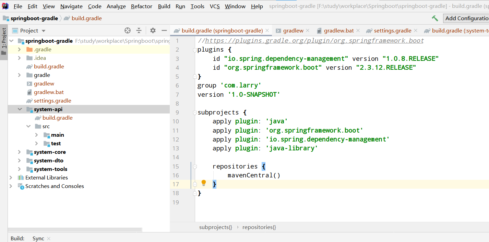

# Building a Multi-Module Spring Boot Application with Gradle


## Why Do We Need Multiple Modules?
Why would we make the effort to split up our codebase into multiple modules when everything works just fine with a single, monolithic module?

The main reason is that a single monolithic codebase is susceptible to architectural decay. Within a codebase, we usually use packages to demarcate architectural boundaries. But packages in Java aren’t very good at protecting those boundaries (more about this in the chapter “Enforcing Architecture Boundaries” of my book). Suffice it to say that the dependencies between classes within a single monolithic codebase tend to quickly degrade into a big ball of mud.

If we split up the codebase into multiple smaller modules that each has clearly defined dependencies to other modules, we take a big step towards an easily maintainable codebase.

## The Example Application



## Parent Build File
To include all modules in the parent build, we first need to list them in the settings.gradle file in the parent folder:
``` gradle
rootProject.name = 'springboot-gradle'
include 'system-api'
include 'system-core'
include 'system-dto'
include 'system-tools'

```
Now, if we call ./gradlew build in the parent folder, Gradle will automatically resolve any dependencies between the modules and build them in the correct order, regardless of the order they are listed in settings.gradle.

In the parent build.gradle file, we now define basic configuration that is shared across all sub-modules:

``` gradle
//https://plugins.gradle.org/plugin/org.springframework.boot
plugins {
    id "io.spring.dependency-management" version "1.0.8.RELEASE"
    id "org.springframework.boot" version "2.3.12.RELEASE"
}
group 'com.larry'
version '1.0-SNAPSHOT'

subprojects {
    apply plugin: 'java'
    apply plugin: 'org.springframework.boot'
    apply plugin: 'io.spring.dependency-management'
    apply plugin: 'java-library'

    repositories {
        mavenCentral()
    }
}
```
in subprojects, we applied springboot plugin and spring dependency management plugin which will help us define depended springboot and spring version, so in subpeoject, we do not need care version

## Module Build Files

``` gradle
dependencies {
    implementation project(':system-core')
    implementation project(':system-dto')
    implementation project(':system-tools')
    implementation 'org.springframework.boot:spring-boot-starter-web'
}
bootRun{
    mainClass = 'com.larry.api.App'
    args=['--spring.profiles.active=local']
}
```
 Note that we did not add a version number because the version is automatically resolved from the spring-boot-dependencies BOM in the parent build file. In this case, we’ll get the version that is compatible with Spring Boot 2.3.12.RELEASE.

 ## Reference
 [https://plugins.gradle.org/plugin/org.springframework.boot](https://plugins.gradle.org/plugin/org.springframework.boot)
 [https://docs.spring.io/spring-boot/docs/3.0.1/gradle-plugin/reference/htmlsingle/](https://docs.spring.io/spring-boot/docs/3.0.1/gradle-plugin/reference/htmlsingle/)

