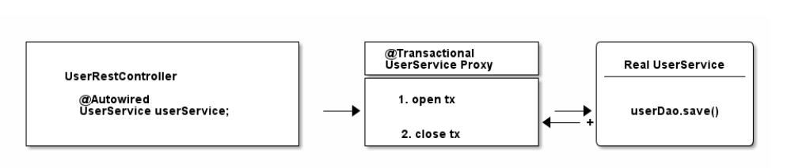

# Spring Transaction Management: @Transactional In-Depth

## Basic Knowledge about JDBC Transaction management

Plain JDBC transaction management code looks like this:
```java
import java.sql.Connection;

Connection connection = dataSource.getConnection(); // (1)

try (connection) {
    connection.setAutoCommit(false); // (2)
    // execute some SQL statements...
    connection.commit(); // (3)

} catch (SQLException e) {
    connection.rollback(); // (4)
}
```
1. You need a connection to the database to start transactions. DriverManager.getConnection(url, user, password) would work as well, though in most enterprise-y applications you will have a data source configured and get connections from that.

2. This is the only way to 'start' a database transaction in Java, even though the name might sound a bit off. setAutoCommit(true) makes sure that every single SQL statement automatically gets wrapped in its own transaction and setAutoCommit(false) is the opposite: You are the master of the transaction(s) and you’ll need to start calling commit and friends. Do note, the autoCommit flag is valid for the whole time your connection is open, which means you only need to call the method once, not repeatedly.

3. Let’s commit our transaction…​

4. Or, rollback our changes, if there was an exception.

## Understanding Isolcation Levels in a Database Transaction
There are 4 main types of isolation levels in a database:
* Read Committed:
  1. No dirty reads: This means the database will not read any of the uncommitted values
  2. No Dirty writes: This means that the database will accept any transaction on a particular row that is already having a transaction running on it. The other transaction has to wait till the point the previous transaction on the rows is committed and only after that, any other transaction will be able to perform a write operation for the specific rows.

* Read Uncommitted
This type of Isolation level is used when we want even the non-committed values of the rows. Any updates and inserts that are even not committed should be reflected in our transaction. This type of isolation level finds heavy use in the booking systems where if any other transaction is trying to update the availability of a seat, even though that transaction is not committed, we should be able to see those changes.

* Repeatable Reads
This isolation level is used when the values on which transactions are to be performed change in the duration of the transaction. For eg, we are having a table of the account balances of Persons. Now, we are having a transaction performing 2 types of tasks on this table:

1. Counting the number of transactions
2. Finding the sum of all the transactions
Now, let’s assume a scenario where any value was inserted on this table after the execution of Query 1. Now, the result of Query 2 will be impacted by this. In such scenarios, we prefer the use of the Reapeable reads Isolation Level which guarantees that the number of rows that are participating in the transaction will retain their current values throughout the transaction. Databases implement the same using the Multi-Version Concurrency Control.

* Serializable
This is the strongest of all the Isolation Levels and guarantees pure isolation. No other transaction will be able to read and write values till this type of transaction is running on the database. This isolation level solves all the problems that were in all 3 previously discussed isolation levels but as this allows only 1 query to execute on the database, it restricts the scalability of the system.

If you already played with Spring’s @Transactional annotation you might have encountered something like this:

```java
@Transactional(propagation=TransactionDefinition.NESTED,
               isolation=TransactionDefinition.ISOLATION_READ_UNCOMMITTED)
```

basic JDBC code:
```java
import java.sql.Connection;

// isolation=TransactionDefinition.ISOLATION_READ_UNCOMMITTED

connection.setTransactionIsolation(Connection.TRANSACTION_READ_UNCOMMITTED); // (1)

// propagation=TransactionDefinition.NESTED

Savepoint savePoint = connection.setSavepoint(); // (2)
...
connection.rollback(savePoint);
```

## How Spring’s or Spring Boot’s Transaction Management works

### Declarative Transaction Management - @Transactional
Now let’s have a look at what modern Spring transaction management usually looks like:
```java
public class UserService {

    @Transactional
    public Long registerUser(User user) {
       // execute some SQL that e.g.
        // inserts the user into the db and retrieves the autogenerated id
        // userDao.save(user);
        return id;
    }
}
```
To make this works, you need to do:

1. Make sure that your Spring Configuration is annotated with the @EnableTransactionManagement annotation (In Spring Boot this will be done automatically for you).

2. Make sure you specify a transaction manager in your Spring Configuration (this you need to do anyway).

```java
    @QuartzTransactionManager
    @Bean(name = "coreTransactionManager")
    public PlatformTransactionManager getTransactionManager(
            @Qualifier("coreEntityManagerFactory") EntityManagerFactory emf) {
        JpaTransactionManager transactionManager = new JpaTransactionManager(emf);
        transactionManager.setDefaultTimeout(120);
        return transactionManager;
    }
```
Spring's @Transactional annotation provides a nice declarative API to mark transactional boundaries.

Behind the scenes, an aspect takes care of creating and maintaining transactions as they are defined in each occurrence of the @Transactional annotation. This approach makes it easy to decouple our core business logic from cross-cutting concerns such as transaction management.


#### The most common @Transactional pitfall
Have a look at the following code:
```java
@Service
public class UserService {

    @Transactional
    public void invoice() {
        createPdf();
        // send invoice as email, etc.
    }

    @Transactional(propagation = Propagation.REQUIRES_NEW)
    public void createPdf() {
        // ...
    }
}
```
You have a UserService class with a transactional invoice method. Which calls createPDF(), which is also transactional.

How many physical transactions would you expect to be open, once someone calls invoice()?

Nope, the answer is not two, but one. Why?

Let’s go back to the proxies' section of this guide. Spring creates that transactional UserService proxy for you, but once you are inside the UserService class and call other inner methods, there is no more proxy involved. This means, no new transaction for you.

Another senario:
```java
@Transactional
public void initialPayment(PaymentRequest request) {
    savePaymentRequest(request); // DB
    callThePaymentProviderApi(request); // API
    updatePaymentState(request); // DB
    saveHistoryForAuditing(request); // DB
}
```
Here we have a few database calls alongside a possibly expensive REST API call. At first glance, it might make sense to make the whole method transactional since we may want to use one EntityManager to perform the whole operation atomically.

However, if that external API takes longer than usual to respond for whatever reason, we may soon run out of database connections!

### Programmatic Transaction Management
1. Using TransactionTemplate
TransactionTemplate provides a set of callback-based APIs to manage transactions manually. In order to use it, we should first initialize it with a PlatformTransactionManager.

```java
@Slf4j
@Service
@Transactional
public class PermissionServiceImpl implements PermissionService {
    /**
     * The PlatformTransactionManager helps the template to create, commit or roll back transactions.

       When using Spring Boot, an appropriate bean of type PlatformTransactionManager will be automatically registered, so we just need to simply inject it.
    */
    @Inject
    private PlatformTransactionManager transactionManager;

    public void addPermissionForSid(ObjectIdentity oi, Permission permission, Sid sid) {
        final TransactionTemplate tt = new TransactionTemplate(transactionManager);

        tt.execute(new TransactionCallbackWithoutResult() {
            @Override
            protected void doInTransactionWithoutResult(TransactionStatus status) {
                MutableAcl acl;
                try {
                    acl = (MutableAcl) aclService.readAclById(oi);
                } catch (final NotFoundException nfe) {
                    acl = aclService.createAcl(oi);
                }
                acl.insertAce(acl.getEntries().size(), permission, sid, true);
                aclService.updateAcl(acl);
            }
        });
    }
}
```

2. Using PlatformTransactionManager
In addition to the TransactionTemplate, we can use an even lower-level API such as PlatformTransactionManager to manage transactions manually. Quite interestingly, both @Transactional and TransactionTemplate use this API to manage their transactions internally.

```java
.....
DefaultTransactionDefinition definition = new DefaultTransactionDefinition();
definition.setIsolationLevel(TransactionDefinition.ISOLATION_REPEATABLE_READ);
definition.setTimeout(3);

 TransactionStatus status = transactionManager.getTransaction(definition);
    try {
        Payment payment = new Payment();
        payment.setReferenceNumber("Ref-1");
        payment.setState(Payment.State.SUCCESSFUL);

        entityManager.persist(payment);
        transactionManager.commit(status);
    } catch (Exception ex) {
        transactionManager.rollback(status);
    }


```


## Reference
[https://www.marcobehler.com/guides/spring-transaction-management-transactional-in-depth](https://www.marcobehler.com/guides/spring-transaction-management-transactional-in-depth)

[Database Isolation Level](https://levelup.gitconnected.com/understanding-isolation-levels-in-a-database-transaction-af78aea3f44)

[https://blog.csdn.net/a779868946/article/details/106504399/](https://blog.csdn.net/a779868946/article/details/106504399/)

[Transaction Isolation and propergation](https://blog.csdn.net/a779868946/article/details/106504399/)

[https://www.baeldung.com/spring-programmatic-transaction-management](https://www.baeldung.com/spring-programmatic-transaction-management)