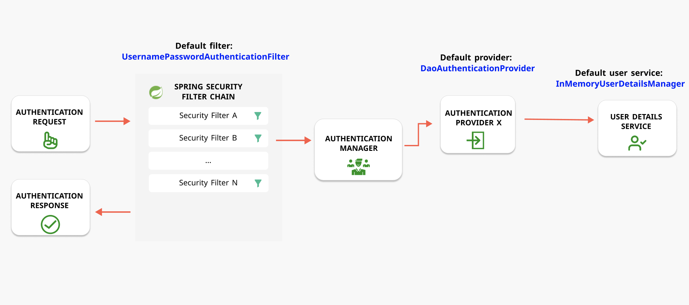

# Authentication and Authorization with Spring Security

[https://docs.spring.io/spring-security/reference/index.html](https://docs.spring.io/spring-security/reference/index.html)

## Stateful and Stateless Authentication Mechanism

### Stateful Authentication (Cookie, Session based authentication):
The server create a Session after user login success (With username and password) and store it in either Database or memory cache on server side.
Then server return session ID to client browser, browser store sessionID in Cookie, for subsequent requests, the server will receive the cookie contains the sessionID and validate user's identity by comparing it with the session stored on the server.

### Stateless Authentication (Token based authentication)
Stateless Authentication using token (JWT token),

JWT token consists of:
* Header
Specifies the JWT encoding and signing algorithm with properties like {"alg":"HS256", "typ":"JWT"}
* Payload
Contains the data(Claims) to be sent
* Signature
this is created by encrypting with algorithm specified in the header 

The Simple authentication process:
1. client request token from authentication server, authentication server authorize user's identity and credential, then issue a JWT Token to client.
2. client receive the token and add the token in Header and send request to target server
3. target server verify token and respond client
Server side does not need to store user's session data and JWT token has an expiration time, after token expired, client need re-request token.

## Spring Security
Spring security is a powerful framework that focuses on providing both authentication and authorization to java applications, also addressing common security vulnerabilities like CSRF and CORS.
without Spring Security, Whenever we expose REST endpoints in Spring Boot, all the incoming requests are first received by the DispatcherServlet. The DispatcherServlet is the front and responsible to dispatch requests to corespondent controller.
With Spring Security added, all the requests are intercepted by Spring Security mechanism before it reaches DispatcherServlet and controller.
Whenever a request arrives at the application, it is first intercepted by a chain of filters called Filter Chain, The Filter Chain after authentication then forwards the request to the DispacherServlet.

Below is simple authentication flow:
1. Filter Chain intercepts incoming request before forwarding it to the Dispatcher Servlet
2. Request visits all filters and finally goes to the authentication filters (one such filter is UsernamePasswordAuthenticationFilter)
3. Authentication filter then call Authentication Manager, Authentication Manager then goes through all providers and try to get at least one success to authenticate user.
4. Authentication Provider fetches user by communicating with user details service and return success state if user exists with given credentials, otherwise, Authentication Provider throw exception.

In order to add security to your spring boot application, you need add the security starter dependency:
```
<dependency>
    <groupId>org.springframework.boot</groupId>
    <artifactId>spring-boot-starter-security</artifactId>
</dependency>
```
By default, the application authentication gets enabled, if you don't configure the password using predefined property spring.security.user.password and start the application, a default password is randomly generated and printed in the console log.
For more defaults, see the security properties section of [Spring docs](https://docs.spring.io/spring-boot/index.html)

If you access your application, you will be direct to login page for username and password. after you press login, this action will send a new authentication request. This request will result following diagram.


1. The new authentication request goes to Spring Security Filter Chain and get caught by UsernamePasswordAuthenticationFilter. This is a default filter designed for the default form login.
2. UsernamePasswordAuthenticationFilter will extract username and password from the authentication request and send them to Authentication Manager. Authentication Manager then send these username and password to DaoAuthenticationProvider, which is default provider. And this provider will go to InMemoryUserDetailsManager, which is default user details service, and check if user exists with given credentials.
3. In Intellij IDEA, press Shift twice to open the Search Everywhere window and type UsernamePasswordAuthenticationFilter. You can put a debug point in attemptAuthentication() method and Run your application in Debug mode to step into more details.

## Get Spring Security
[https://docs.spring.io/spring-security/reference/getting-spring-security.html](https://docs.spring.io/spring-security/reference/getting-spring-security.html)

## Custom Filter
Spring security support custom filter which will handle the sing-in authentication flow to authenticate the credentials


