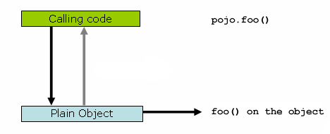
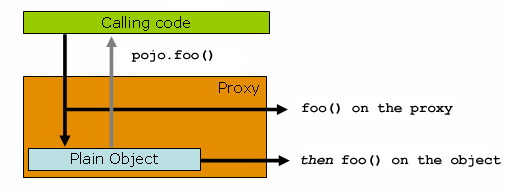

# Aspect Oriented Programming with Spring

## Understanding AOP proxies
Spring AOP is proxy-based.

```java
public class SimplePojo implements Pojo {

    public void foo() {
        // this next method invocation is a direct call on the 'this' reference
        this.bar();
    }

    public void bar() {
        // some logic...
    }
}
```
If you invoke a method on an object reference, the method is invoked directly on that object reference, as can be seen below.



Things change slightly when the reference that client code has is a proxy. Consider the following diagram and code snippet.



The class org.springframework.aop.aspectj.annotation.AspectJProxyFactory can be used to create a proxy for a target object that is advised by one or more @AspectJ aspects. Basic usage for this class is very simple, as illustrated below. See the javadocs for full information.

## Use AOP for audit

## use AOP for logging

### Declear an aspect by @Aspect

```java
package org.xyz;
import org.aspectj.lang.annotation.Aspect;

@Aspect
public class NotVeryUsefulAspect {

}
```

### Declear a pointcut @pointcut("execution ( * com.larry.aop.controller.*.*(..))")

```java
    @Pointcut("@annotation(com.larry.audit.Audited)")
    public void doAudit(){
    }

```

### Declear Advice:

@Before()
@After()
@Arround()

...

```java
@Around("doAudit()")
    public Object executeWithAuditContext(ProceedingJoinPoint joinPoint){
        MethodSignature methodSignature = (MethodSignature)joinPoint.getSignature();
        Method method = methodSignature.getMethod();
        System.out.println("@@@@ Auditted@@@@" + method.getName());
        Audited audited = method.getAnnotation(Audited.class);
        System.out.println(audited.action());
        return null;
    }
```


## Reference
[https://docs.spring.io/spring-framework/docs/2.5.5/reference/aop.html](https://docs.spring.io/spring-framework/docs/2.5.5/reference/aop.html)

[Spring-boot doc](https://docs.spring.io/spring-framework/docs/4.3.15.RELEASE/spring-framework-reference/html/)

[https://reflectoring.io/aop-spring/](https://reflectoring.io/aop-spring/)