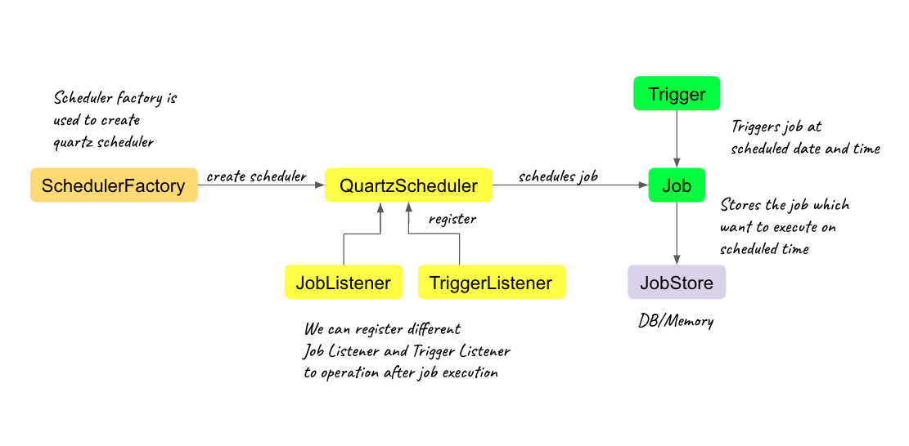

# Scheduling in Spring with Quartz

## The Quartz API
Quartz is an open source job-scheduling framework written entirely in Java and designed for use in both J2SE and J2EE applications. 

Maven dependency:
```xml
<dependency>
    <groupId>org.quartz-scheduler</groupId>
    <artifactId>quartz</artifactId>
    <version>2.3.0</version>
</dependency>
```
The latest version can be found in the [Maven Central repository](https://central.sonatype.com/search?q=quartz).

The heart of the framework is the Scheduler. It is responsible for managing the runtime environment for our application.
To ensure scalability, Quartz is based on a multi-threaded architecture. When started, the framework initializes a set of worker threads that are used by the Scheduler to execute Jobs.
This is how the framework can run many Jobs concurrently. It also relies on a loosely coupled set of ThreadPool management components for managing the thread environment.

The key interfaces of the API are:
* Scheduler – the primary API for interacting with the scheduler of the framework
* Job – an interface to be implemented by components that we wish to have executed
* JobDetail – used to define instances of Jobs
* Trigger – a component that determines the schedule upon which a given Job will be performed
* JobBuilder – used to build JobDetail instances, which define instances of Jobs
* TriggerBuilder – used to build Trigger instances

### Scheduler
Before we can use the Scheduler, it needs to be instantiated. To do this, we can use the factory SchedulerFactory:
````java
SchedulerFactory schedulerFactory = new StdSchedulerFactory();
Scheduler scheduler = schedulerFactory.getScheduler();
````
Scheduler interface can be used to add, remove, and list Jobs and Triggers, and perform other scheduling-related operations (such as pausing a trigger).
the Scheduler will not act on any triggers until it has been started with the start() method:
`scheduler.start();`

###  Jobs
A Job is a class that implements the Job interface. It has only one simple method:
```java
public class SimpleJob implements Job {
    public void execute(JobExecutionContext arg0) throws JobExecutionException {
        System.out.println("This is a quartz job!");
    }
}
```
When the Job’s trigger fires, the execute() method gets invoked by one of the scheduler’s worker threads.
The JobExecutionContext object that is passed to this method provides the job instance, with information about its runtime environment, a handle to the Scheduler that executed it, a handle to the Trigger that triggered the execution, the job’s JobDetail object, and a few other items.

The JobDetail object is created by the Quartz client at the time the Job is added to the Scheduler. It is essentially the definition of the job instance:
```java
JobDetail job = JobBuilder.newJob(SimpleJob.class)
  .withIdentity("myJob", "group1")
  .build();

```
This object may also contain various property settings for the Job, as well as a JobDataMap, which can be used to store state information for a given instance of our job class.

### JobDataMap
The JobDataMap is used to hold any amount of data objects that we wish to make available to the job instance when it executes. JobDataMap is an implementation of the Java Map interface and has some added convenience methods for storing and retrieving data of primitive types.

Here’s an example of putting data into the JobDataMap while building the JobDetail, before adding the job to the scheduler:
```java
JobDetail job = newJob(SimpleJob.class)
  .withIdentity("myJob", "group1")
  .usingJobData("jobSays", "Hello World!")
  .usingJobData("myFloatValue", 3.141f)
  .build();
```
And here is an example of how to access these data during the job’s execution:
```java
public class SimpleJob implements Job { 
    public void execute(JobExecutionContext context) throws JobExecutionException {
        JobDataMap dataMap = context.getJobDetail().getJobDataMap();

        String jobSays = dataMap.getString("jobSays");
        float myFloatValue = dataMap.getFloat("myFloatValue");

        System.out.println("Job says: " + jobSays + ", and val is: " + myFloatValue);
    } 
}
```

### Triggers
Trigger objects are used to trigger the execution of Jobs.
When we wish to schedule a Job, we need to instantiate a trigger and adjust its properties to configure our scheduling requirements:
```java
Trigger trigger = TriggerBuilder.newTrigger()
  .withIdentity("myTrigger", "group1")
  .startNow()
  .withSchedule(SimpleScheduleBuilder.simpleSchedule()
    .withIntervalInSeconds(40)
    .repeatForever())
  .build();
```
A Trigger may also have a JobDataMap associated with it. This is useful for passing parameters to a Job that are specific to the executions of the trigger.
There are different types of triggers for different scheduling needs. Each one has different TriggerKey properties for tracking their identities. However, some other properties are common to all trigger types:
* The jobKey property indicates the identity of the job that should be executed when the trigger fires.
* The startTime property indicates when the trigger’s schedule first comes into effect. The value is a java.util.Date object that defines a moment in time for a given calendar date. For some trigger types, the trigger fires at the given start time. For others, it simply marks the time that the schedule should start.
* The endTime property indicates when the trigger’s schedule should be canceled.
Quartz ships with a handful of different trigger types, but the most commonly used ones are SimpleTrigger and CronTrigger.

### Priority
Sometimes, when we have many triggers, Quartz may not have enough resources to immediately fire all of the jobs are scheduled to fire at the same time. In this case, we may want to control which of our triggers gets available first. This is exactly what the priority property on a trigger is used for.
For example, when ten triggers are set to fire at the same time and merely four worker threads are available, the first four triggers with the highest priority will be executed first. When we do not set a priority on a trigger, it uses a default priority of five. Any integer value is allowed as a priority, positive or negative.
In the example below, we have two triggers with a different priority. If there aren’t enough resources to fire all the triggers at the same time, triggerA will be the first one to be fired:
```java
Trigger triggerA = TriggerBuilder.newTrigger()
  .withIdentity("triggerA", "group1")
  .startNow()
  .withPriority(15)
  .withSchedule(SimpleScheduleBuilder.simpleSchedule()
    .withIntervalInSeconds(40)
    .repeatForever())
  .build();
            
Trigger triggerB = TriggerBuilder.newTrigger()
  .withIdentity("triggerB", "group1")
  .startNow()
  .withPriority(10)
  .withSchedule(SimpleScheduleBuilder.simpleSchedule()
    .withIntervalInSeconds(20)
    .repeatForever())
  .build();

```

### Misfire Instructions
A misfire occurs if a persistent trigger misses its firing time because of the Scheduler being shut down, or in case there are no available threads in Quartz’s thread pool.
The different trigger types have different misfire instructions available. By default, they use a smart policy instruction. When the scheduler starts, it searches for any persistent triggers that have misfired. After that, it updates each of them based on their individually configured misfire instructions.
Let’s take a look at the examples below:
```java
Trigger misFiredTriggerA = TriggerBuilder.newTrigger()
  .startAt(DateUtils.addSeconds(new Date(), -10))
  .build();
            
Trigger misFiredTriggerB = TriggerBuilder.newTrigger()
  .startAt(DateUtils.addSeconds(new Date(), -10))
  .withSchedule(SimpleScheduleBuilder.simpleSchedule()
    .withMisfireHandlingInstructionFireNow())
  .build();
```
In the first trigger (misFiredTriggerA) no misfire handling instructions are set. Hence a called smart policy is used in that case and is called: withMisfireHandlingInstructionFireNow(). This means that the job is executed immediately after the scheduler discovers the misfire.

The second trigger explicitly defines what kind of behavior we expect when misfiring occurs. In this example, it just happens to be the same smart policy.

###  SimpleTrigger
SimpleTrigger is used for scenarios in which we need to execute a job at a specific moment in time. This can either be exactly once or repeatedly at specific intervals.
An example could be to fire a job execution at exactly 12:20:00 AM on January 13, 2018. Similarly, we can start at that time, and then five more times, every ten seconds.

In the code below, the date myStartTime has previously been defined and is used to build a trigger for one particular timestamp:
````java
SimpleTrigger trigger = (SimpleTrigger) TriggerBuilder.newTrigger()
  .withIdentity("trigger1", "group1")
  .startAt(myStartTime)
  .forJob("job1", "group1")
  .build();
````
Next, let’s build a trigger for a specific moment in time, then repeating every ten seconds ten times:
```java
SimpleTrigger trigger = (SimpleTrigger) TriggerBuilder.newTrigger()
  .withIdentity("trigger2", "group1")
  .startAt(myStartTime)
  .withSchedule(simpleSchedule()
    .withIntervalInSeconds(10)
    .withRepeatCount(10))
  .forJob("job1") 
  .build();
```

### CronTrigger
specify firing-schedules such as every Friday at noon or every weekday at 9:30 am.

Cron-Expressions are used to configure instances of CronTrigger. These expressions consist of Strings that are made up of seven sub-expressions. We can read more about Cron-Expressions here.

In the example below, we build a trigger that fires every other minute between 8 am and 5 pm, every day:

```java
CronTrigger trigger = TriggerBuilder.newTrigger()
  .withIdentity("trigger3", "group1")
  .withSchedule(CronScheduleBuilder.cronSchedule("0 0/2 8-17 * * ?"))
  .forJob("myJob", "group1")
  .build();
```

## Working with Quartz Scheduler using Spring Boot

Spring Boot offers spring-boot-starter-quartz,
By Default, an in-memory jobStore is used, it is possible to configure a JDBC-based store.



we are going to use QuartzScheduler to schedule a job/task.
the steps we need to follow and components we need to get started with most schedule a job is
1. writing job store configuration
2. Creating Job Bean
3. Creating Trigger and Job Details
4. Scheduler Job using Quartz Scheduler

let’s understand each steps

### Step 1: Job Store Configuration
configure below configurations in application.properties
```java
# store type either in-memory or jdbc to store in D
spring.quartz.job-store-type=jdbc
# to create tables used to store job and other scheduling activities
spring.quartz.jdbc.initialize-schema=always
 
# datasource to store jobs in DB if store type is jdbc
spring.jpa.properties.hibernate.dialect = org.hibernate.dialect.PostgreSQLDialect
spring.jpa.hibernate.ddl-auto=update
spring.jpa.hibernate.show-sql=true
spring.datasource.url=jdbc:postgresql://localhost:5432/EMS
spring.datasource.username=postgres
spring.datasource.password=admin
 
spring.quartz.properties.org.quartz.jobStore.driverDelegateClass=org.quartz.impl.jdbcjobstore.PostgreSQLDelegate
 
# if you want to provide multiple threads to run jobs
spring.quartz.properties.org.quartz.threadPool.threadCount=5B
```
let’s understand few of these configuration
spring.quartz.job-store-type=jdbc property is used to define the job store we want to use in this case the value jdbcrepresents that we want to store job, triggers etc in Datasource configured
we can also use value as memory which is used to store job in in-memory
we need Quartz tables to store jobs in database we can use initilize property spring.quartz.jdbc.initialize-schema=always to automatically create the tables required is used to automatic
if you want to create tables manually you can use the official SQL script provided by quartz (https://github.com/callicoder/spring-boot-quartz-scheduler-email-scheduling/blob/master/src/main/resources/quartz_tables.sql)
we can also configure the number of concurrent threads we can use using spring.quartz.properties.properties.properties.org.quartz.threadpool.threadCount=5
aside from this we have to configure DB properties where we are going to store the jobs it can H2 DB or others.

### Step2: Create Job Bean - extend it with QuartzJobBean
```java
public class SampleJob extends QuartzJobBean{
    @Override
    protected void executeInternal(JobExecutionContext context) throws JobExecutionException {
        String dataPassed = context.getMergedJobDataMap().get("data").toString();
        System.out.printf("Data passed from jobDetails: "+ dataPassed);
    }
}
```

### Step3: create trigger and job details
In our demo example, we create a quartz service that will create jobDetails and Trigger, and in controller, will invoke the service to start scheduler and manage our quartz jobs

```java
@Service
@Slf4j
public class QuartzService {
    @Autowired
    private Scheduler scheduler;

    public void fireSimpleJob(){
        try{
            JobDetail jobDetail = this.buildJobDetailsForSimpleJob();
            Trigger trigger = this.buildTriggerForSimpleJob(jobDetail);
            scheduler.scheduleJob(jobDetail, trigger);
        }catch (Exception e){
            e.printStackTrace();
        }
    }
    private JobDetail buildJobDetailsForSimpleJob(){
        JobDataMap jobDataMap = new JobDataMap();
        jobDataMap.put("data", "Data can be passed to job, and could be consumed by others!");
        return JobBuilder.newJob(SampleJob.class).
                withIdentity(UUID.randomUUID().toString(), "SimpleJob").
                withDescription("Description of SimpleJob").
                usingJobData(jobDataMap).//pass data that job need
                storeDurably(true). //false - delete job once job executed
                build();
    }
    private Trigger buildTriggerForSimpleJob(JobDetail jobDetail){
        ZonedDateTime dateTime = ZonedDateTime.of(LocalDate.parse("2023-12-18"),
                LocalTime.of(10, 40), ZoneId.systemDefault());
        return TriggerBuilder.newTrigger().
                forJob(jobDetail).
                withIdentity(jobDetail.getKey().getName(), "SimpleJobTrigger").
                withDescription("SimpleJobTrigger").
                //startNow().
                        startAt(Date.from(dateTime.toInstant())).
                withSchedule(SimpleScheduleBuilder.repeatSecondlyForTotalCount(2, 2)).
                build();
    }
}

```

### Step4: Schedule job with quartz Schedule

```java
    public void fireSimpleJob(){
        try{
            JobDetail jobDetail = this.buildJobDetailsForSimpleJob();
            Trigger trigger = this.buildTriggerForSimpleJob(jobDetail);
            scheduler.scheduleJob(jobDetail, trigger);
        }catch (Exception e){
            e.printStackTrace();
        }
    }
```

### Step5: call Schedule
```java
@RestController
@RequestMapping("/api/quartz")
public class QuartzController {
    @Autowired
    private QuartzService quartzService;

    @GetMapping(value = "/simpleJob")
    public ResponseEntity<String> fireSimpleJob(){
        quartzService.fireSimpleJob();
        return ResponseEntity.ok("SimpleJob Fired!");
    }
}
```
